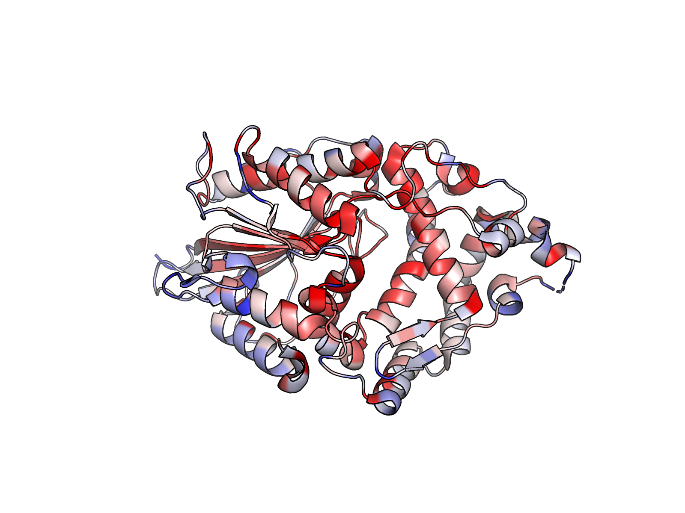
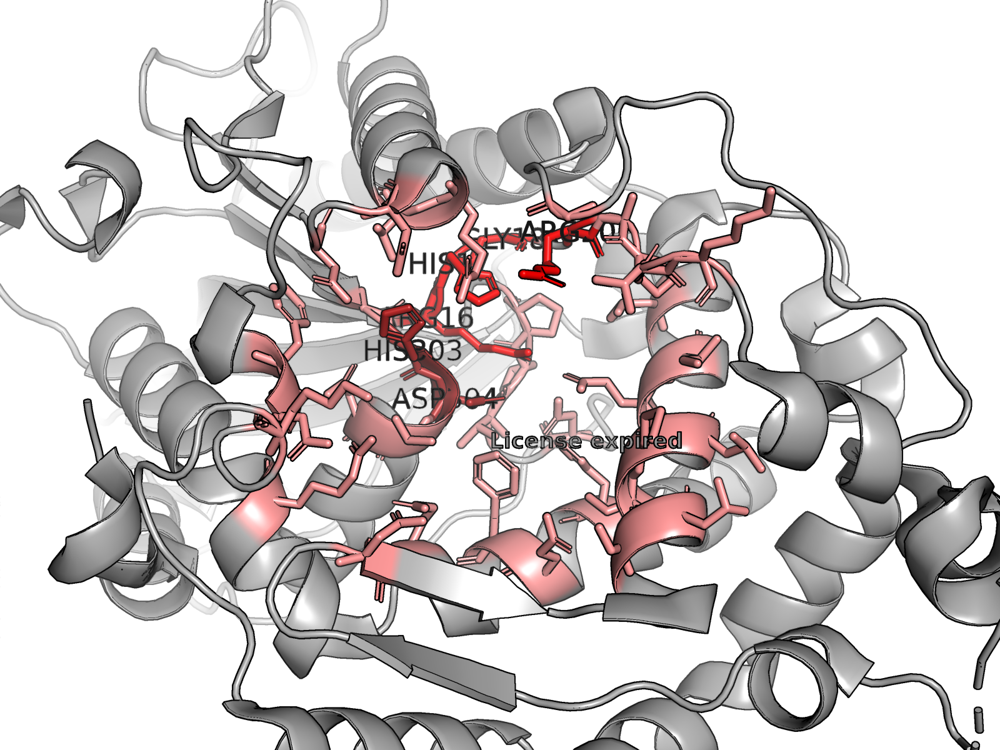
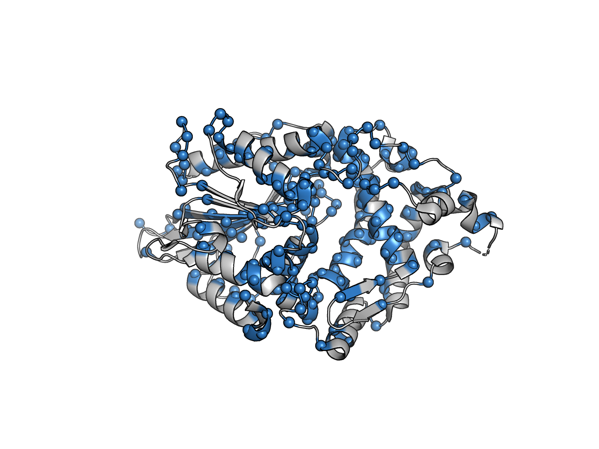
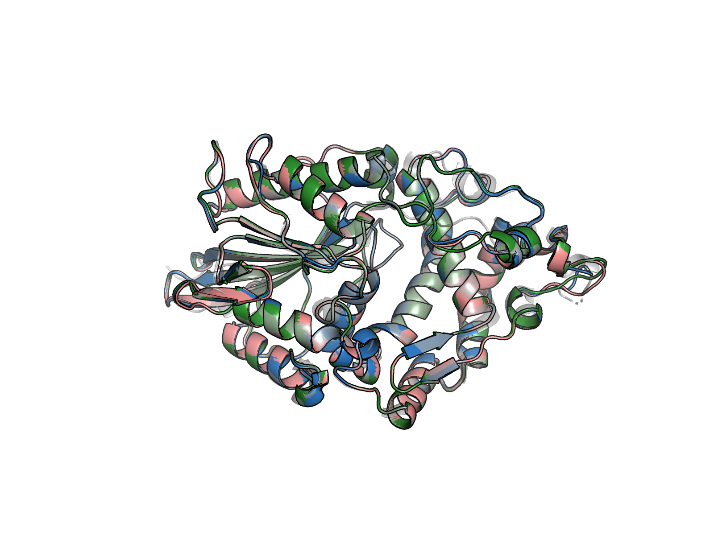

# Diseño computacional de variantes termoestables de la fitasa AppA

[]() []() [](https://www.rcsb.org/structure/1DKL) [](https://pmc.ncbi.nlm.nih.gov/articles/PMC10811672/)

> **Laboratorio de Fisicoquímica e Ingeniería de Proteínas** · **PI:** Daniel Alejandro Fernández · **Autor:** Xzamu
> Reporte técnico — 2026-04-16 — alcance exclusivamente computacional.

---

## Tabla de contenido

1. [Resumen ejecutivo](#1-resumen-ejecutivo)
2. [Contexto y objetivo](#2-contexto-y-objetivo)
3. [Pipeline computacional](#3-pipeline-computacional)
4. [Paso 1 — Estructura base](#4-paso-1--estructura-base)
5. [Paso 2 — Análisis de conservación (ConSurf)](#5-paso-2--análisis-de-conservación-consurf)
6. [Paso 3 — Sitio activo (7 Å del ligando)](#6-paso-3--sitio-activo-7-å-del-ligando)
7. [Paso 4 — Construcción del set redesignable](#7-paso-4--construcción-del-set-redesignable)
8. [Paso 5 — Rediseño con ProteinMPNN](#8-paso-5--rediseño-con-proteinmpnn)
9. [Paso 6 — Plegamiento con AlphaFold 3](#9-paso-6--plegamiento-con-alphafold-3)
10. [Paso 7 — Relajación y scoring con PyRosetta](#10-paso-7--relajación-y-scoring-con-pyrosetta)
11. [Paso 8 — Ranking combinado](#11-paso-8--ranking-combinado)
12. [Variantes finales (Fitasa-01 / 02 / 03)](#12-variantes-finales-fitasa-01--02--03)
13. [Líneas futuras](#13-líneas-futuras)
14. [Referencias](#14-referencias)
15. [Estructura del repositorio](#15-estructura-del-repositorio)
16. [Anexo A — Secuencias](#anexo-a--secuencias-de-las-variantes-finales)

---

## 1. Resumen ejecutivo

Se diseñaron *in silico* variantes de la **fitasa AppA de _Escherichia coli_** (PDB [1DKL](https://www.rcsb.org/structure/1DKL), clase HAP) con el objetivo de aumentar su **termoestabilidad** sin comprometer la arquitectura del sitio activo ni la afinidad por fitato. El pipeline combinó:

1. Análisis de conservación evolutiva con **ConSurf** sobre 172 homólogos únicos.
2. Delimitación del sitio activo a **7 Å del ligando** (sobre el cocristal 1DKP).
3. Construcción de un set de **~201 posiciones redesignables** (fijando sitio activo + residuos más conservados, calibrado para obtener **~70 % de identidad de secuencia**, siguiendo la lógica de **Sumida et al., 2024**).
4. Rediseño con **ProteinMPNN** a tres temperaturas (0.1, 0.2, 0.3) con sesgo negativo a cisteína.
5. Predicción estructural de las 51 secuencias con **AlphaFold 3 Server**.
6. Relajación y scoring físico con **PyRosetta FastRelax / ref2015**.
7. Ranking multimétrica combinada **pLDDT + Rosetta** en dos escenarios (50/50 y 60/40).

Se seleccionaron **3 variantes finales** para síntesis génica: **Fitasa-01**, **Fitasa-02** y **Fitasa-03** (ver [tabla](#12-variantes-finales-fitasa-01--02--03)).

---

## 2. Contexto y objetivo

### 2.1 Objetivo

Diseñar variantes de la fitasa AppA de _E. coli_ con **mayor termoestabilidad** sin afectar su **afinidad catalítica por el sustrato** (fitato / InsP6), utilizando herramientas de IA de *inverse folding* y filtros físico-químicos. Se seleccionaron **3 variantes candidatas** para expresión y purificación (fase experimental posterior, fuera del alcance de este reporte).

### 2.2 Relevancia

Las fitasas industriales deben sobrevivir las temperaturas de peletizado en alimento balanceado (**~65–95 °C** por decenas de segundos). AppA combina alta actividad catalítica con termoestabilidad limitada. La redistribución de residuos no esenciales en superficie/core, preservando sitio activo y motivos conservados, es una estrategia validada para mejorar la tolerancia térmica (Sumida et al., 2024; Navone et al., 2021; Xing et al., 2023).

### 2.3 Inspiración metodológica

Todo el pipeline se basa en **Sumida KH et al. (2024). _Improving Protein Expression, Stability, and Function with ProteinMPNN_. JACS 146(3):2054–2061**, ajustado a un target fitasa. Interpretación clave del artículo: el objetivo **no es fijar el 70 % de los residuos**, sino alcanzar un **~70 % de identidad de secuencia final** respecto al WT. Como ProteinMPNN recupera espontáneamente una fracción de los residuos no fijados (*sequence recovery* ≈ 48–52 % en backbones nativos), se puede **fijar menos del 70 %** y aun así quedar cerca de esa identidad.

---

## 3. Pipeline computacional

```
┌────────────────────────┐
│ PDB 1DKL (AppA, E.coli)│
└──────────┬─────────────┘
           │
           ▼
┌────────────────────────────────────┐
│ (1) Conservación (ConSurf)         │  172 homólogos · score Bayesiano
│ (2) Sitio activo (7 Å de ligando)  │  1DKP como referencia estructural
│ (3) Definición de set redesignable │  ~201 residuos (70 % identidad target)
└──────────┬─────────────────────────┘
           │
           ▼
┌────────────────────────────────────┐
│ (4) Rediseño con ProteinMPNN       │  3 temperaturas (0.1 / 0.2 / 0.3)
│     Modelo v_48_020 · bias Cys-3.0 │  17 seqs/temp = 51 totales
└──────────┬─────────────────────────┘
           │
           ▼
┌────────────────────────────────────┐
│ (5) Plegamiento con AlphaFold 3    │  50 estructuras predichas
│     pLDDT promedio por secuencia   │
└──────────┬─────────────────────────┘
           │
           ▼
┌────────────────────────────────────┐
│ (6) Threading + FastRelax Rosetta  │  ref2015 · top-10 por pLDDT
│     Energía total por modelo       │
└──────────┬─────────────────────────┘
           │
           ▼
┌────────────────────────────────────┐
│ (7) Ranking combinado (2 pesos)    │  50/50 y 60/40 pLDDT–Rosetta
│     Selección de 3 finales         │
└──────────┬─────────────────────────┘
           │
           ▼
┌────────────────────────────────────┐
│ Fitasa-01, Fitasa-02, Fitasa-03    │  → síntesis génica
└────────────────────────────────────┘
```

---

## 4. Paso 1 — Estructura base

- **PDB seleccionado:** [1DKL](https://www.rcsb.org/structure/1DKL) (AppA de _E. coli_).
- **Uso:** tal cual del PDB, sin minimización previa ni reconstrucción de residuos faltantes.
- **Plegamiento:** dos dominios (α/β + α) con bolsillo catalítico positivamente cargado entre ellos.
- **Motivos catalíticos:** **RHGXRXP** (His nucleófilo) y **HD/HAE** (donador protónico).
- **Extensión:** ~410 residuos por cadena; 1DKL es homodímero, la cadena A fue la usada como base.

**Candidatos descartados:**

| PDB   | Motivo de descarte                                                         |
|-------|----------------------------------------------------------------------------|
| 4TSR  | Mutante, referencia principal no publicada al momento                       |
| 1DKQ  | Mutante con sustitución en la His catalítica → sitio activo alterado       |

Se usó **1DKP** únicamente como referencia para definir el sitio activo (cocristal con análogo de fitato), **no** como backbone de diseño.

---

## 5. Paso 2 — Análisis de conservación (ConSurf)

### 5.1 Servidor y parámetros

**Servidor:** [ConSurf-DB](https://consurfdb.tau.ac.il/main_output_new.php?pdb=1DKL&chain=A) · [Ashkenazy et al., NAR 2016](https://academic.oup.com/nar/article/44/W1/W344/2499373)

| Parámetro                        | Valor                                  |
|----------------------------------|----------------------------------------|
| Estructura de entrada            | 1DKL, cadena A                         |
| Base de datos                    | UNIREF90                               |
| Búsqueda de homólogos            | HMMER (E-value 1e-4, 1 iteración)      |
| CD-HIT cutoff                    | 95 % (identidad máxima entre homólogos)|
| Coverage mínimo                  | 60 % de la query                       |
| MSA                              | MAFFT                                  |
| Filogenia                        | Neighbor Joining con distancias ML     |
| Modelo de sustitución            | WAG (mejor ajuste)                     |
| Scoring de conservación          | Método Bayesiano                       |

### 5.2 Resultados

- **1 934** homólogos recuperados → **180** pasan filtros → **172 únicos CD-HIT** usados en el cálculo.
- Distancia pareada promedio: **1.27** (rango 0.05 – 2.05).

### Figura 1 — Mapa de conservación ConSurf sobre 1DKL



*Cartoon del homodímero 1DKL coloreado por grado de conservación (rojo = más conservado → azul = más variable). El script generador está en [`pymol_scripts/fig1_consurf_conservation.pml`](pymol_scripts/fig1_consurf_conservation.pml).*

---

## 6. Paso 3 — Sitio activo (7 Å del ligando)

### 6.1 Criterio

Usando **1DKP** (complejo fitasa–ligando análogo de fitato) como referencia, se extrajeron todos los residuos con al menos un átomo a **≤ 7 Å del ligando**. Estos residuos nunca se redistribuyen.

### 6.2 Residuos identificados (39 posiciones)

Archivo: [`data/Active_site_7aFromLigand.txt`](data/Active_site_7aFromLigand.txt)

```
ARG16  ALA17  GLY18  ARG20  ALA21  PRO22  THR23  LYS24
GLY45  ASP88  ASP90  ARG92  THR93  PHE125 ASN126 LYS129
ASN204 SER212 LEU213 SER215 MET216 LEU217 GLU219 ILE220
LEU223 HIS250 GLN253 PHE254 GLN258 ARG267 GLY302 HIS303
ASP304 THR305 ASN306 ASP325 THR327 PRO328 PRO329
```

Incluye los motivos canónicos de HAP: el núcleo **R16-H17-G18-R20** (parte de RHGXRXP) y **H303-D304** (HD).

### Figura 2 — Sitio activo con motivos catalíticos



*Vista zoom del sitio activo. En salmón, las 39 posiciones ≤ 7 Å del ligando. En rojo los motivos canónicos **R16-H17-G18-R20** (RHGXRXP) y en rojo oscuro **H303-D304** (HD). Script: [`pymol_scripts/fig2_active_site.pml`](pymol_scripts/fig2_active_site.pml).*

---

## 7. Paso 4 — Construcción del set redesignable

### 7.1 Lógica de selección (principio 70 % identidad)

El objetivo no era fijar literalmente el 70 %, sino garantizar que la **secuencia diseñada final compartiera ~70 % de identidad** con el WT. Dado que ProteinMPNN recupera espontáneamente ~48–52 % de los residuos no fijados (`overall_confidence` y `seq_rec` reportados por la herramienta al final de cada diseño), el set fijado puede ser menor al 70 % y aun así alcanzar esa identidad.

### 7.2 Procedimiento

1. Ordenar todas las posiciones por conservación (ConSurf).
2. Tomar las **50 más conservadas** del ranking.
3. **Excluir** de ese Top 50 las posiciones que ya forman parte del **sitio activo** (para no contarlas dos veces): 10 posiciones **(A21, A126, A129, A204, A212, A213, A217, A253, A258, A267)**. Archivo: [`data/ActiveSiteAA-ExcludedFromTop50.csv`](data/ActiveSiteAA-ExcludedFromTop50.csv).
4. **Unir**: sitio activo (39) + Top-50 conservadas no-activo (~40) + otras posiciones conservadas complementarias hasta llegar al umbral deseado, **dejando ~201 posiciones libres para rediseño**.
5. Exportar la lista al formato requerido por ProteinMPNN: [`data/FIXED_residues_format.txt`](data/FIXED_residues_format.txt) (pese al nombre del archivo, esta lista contiene las **posiciones a rediseñar**).

### 7.3 Resultado

- **Posiciones rediseñables:** 201 (desde A1 hasta A410).
- **Posiciones fijas:** ~209 (sitio activo + residuos más conservados).
- **Identidad esperada:** ~70 % entre variante diseñada y WT, tras recuperación espontánea de MPNN.

### 7.4 Dos escenarios paralelos: BN vs FLLS

Se corrió el pipeline con **dos sets de residuos** en paralelo:

- **BN** (bien / set final) — produjo los candidatos finales.
- **FLLS** (fallos / set descartado) — peores resultados aguas abajo.

> Los argumentos exactos del script (`ArgumentosProteinMPNN`) son **idénticos** en ambos; la diferencia real estuvo en el contenido del archivo `fixed_residues` cargado en ejecución. La rama BN fue la seleccionada.

### Figura 3 — Residuos fijados vs rediseñados



*Cα en esferas: **rojo** = residuos fijados (~209, sitio activo + más conservados); **azul** = posiciones rediseñadas (201). Script: [`pymol_scripts/fig3_fixed_vs_redesigned.pml`](pymol_scripts/fig3_fixed_vs_redesigned.pml).*

---

## 8. Paso 5 — Rediseño con ProteinMPNN

### 8.1 Configuración

Script completo: [`scripts/ArgumentosProteinMPNN.sh`](scripts/ArgumentosProteinMPNN.sh)

```bash
python run.py \
    --model_type "protein_mpnn" \
    --seed 111 \
    --pdb_path "./inputs/1dkl.pdb" \
    --temperature {0.1 | 0.2 | 0.3} \
    --out_folder "./outputs/redesign_residuesT0{1|2|3}" \
    --redesigned_residues "A1 A2 A4 A8 ... A410"  # 201 posiciones
    --bias_AA "C:-3.0" \
    --batch_size 2 \
    --number_of_batches 8
```

- **Modelo:** ProteinMPNN checkpoint **`proteinmpnn_v_48_020.pt`** (0.20 Å de ruido de entrenamiento).
  *Nota:* el header de salida reporta `use_ligand_context=True`; este flag es informativo del wrapper común con LigandMPNN, pero el modelo usado es **ProteinMPNN**. No se incorporó explícitamente el fitato en el diseño.
- **Seed fijo (111)** → reproducibilidad.
- **Bias `C:-3.0`** → penaliza fuertemente introducir cisteínas nuevas (evita disulfuros artefactuales).
- **Sampling:** 3 temperaturas (T01 = 0.1 conservador · T02 = 0.2 balanceado · T03 = 0.3 diverso).
- **Producción:** 16 secuencias/temperatura + referencia WT ⇒ **17 seqs × 3 T = 51 totales**.

### 8.2 Métricas reportadas por MPNN

- `overall_confidence` ≈ 0.40–0.50
- `seq_rec` ≈ **0.45–0.52** (fracción de residuos recuperados en las posiciones rediseñables), consistente con Dauparas et al. 2022.

---

## 9. Paso 6 — Plegamiento con AlphaFold 3

### 9.1 Configuración

| Parámetro | Valor                                            |
|-----------|--------------------------------------------------|
| Servidor  | [AlphaFold Server](https://alphafoldserver.com/) |
| Input     | Secuencia de proteína únicamente                  |
| Modelos   | Defaults (5 semillas, JSON + CIF)                 |
| Output    | `AlphaFold-T01-T03/` — 50 subcarpetas             |

### 9.2 Cálculo de pLDDT promedio

Script R: [`scripts/AlphaFold3-Analysis.R`](scripts/AlphaFold3-Analysis.R). Extrae `atom_plddts` de los `full_data_<n>.json` y promedia sobre átomos.

### 9.3 Resultados

Archivo completo: [`data/resultados_promedios_plddt.csv`](data/resultados_promedios_plddt.csv).

**Rango general de pLDDT:** 94.93 – 96.19 (todos **≫ 85**, umbral de Sumida et al.).

| Temperatura | Secuencias | pLDDT medio | Comentario               |
|-------------|-----------:|------------:|--------------------------|
| T01 (0.1)   |         17 |      ~95.7  | Los más conservadores    |
| T02 (0.2)   |         17 |      ~95.6  | Balanceados              |
| T03 (0.3)   |         17 |      ~95.8  | Diversos pero plegables  |

**Top 10 por pLDDT** ([`data/top_10_secuencias_plddt.csv`](data/top_10_secuencias_plddt.csv)):

| Rank | Modelo                       | Grupo | pLDDT   |
|-----:|------------------------------|-------|--------:|
|  1   | t03_2025_07_03_11_59_6       | T03   | 96.1949 |
|  2   | t01_2025_07_03_11_45         | T01   | 96.1948 |
|  3   | t03_2025_07_03_11_59_3 ★     | T03   | 96.1779 |
|  4   | t02_2025_07_03_11_48 ★       | T02   | 96.0333 |
|  5   | t02_2025_07_03_11_51_2       | T02   | 96.0194 |
|  6   | t03_2025_07_03_12_00_8       | T03   | 95.9607 |
|  7   | t03_2025_07_03_11_59_4       | T03   | 95.8787 |
|  8   | t02_2025_07_03_11_48_2       | T02   | 95.8746 |
|  9   | t02_2025_07_03_11_50_3 ★     | T02   | 95.8485 |
|  10  | t02_2025_07_03_11_49_3       | T02   | 95.8480 |

★ = seleccionadas finalmente para síntesis.

---

## 10. Paso 7 — Relajación y scoring con PyRosetta

### 10.1 Protocolo

Script: [`scripts/evaluate_sequence.py`](scripts/evaluate_sequence.py).

1. **Backbone plantilla:** `fitasa_backbone_clean_1DKL.pdb` (WT limpiado).
2. **Threading:** cada secuencia de las Top-10 se monta sobre el backbone con `MutateResidue`.
3. **Relajación:** `FastRelax()` con `scorefxn = ref2015`, flags `-ex1 -ex2 -use_input_sc`.
4. Cada secuencia AF3 tiene 5 modelos ⇒ se usa el ranking `ranking_top1.tsv` para quedarse con la **mejor pose** por diseño.

### 10.2 Resultados (top Rosetta por diseño)

Archivo: [`data/ranking_top1.tsv`](data/ranking_top1.tsv).

| Rank | Diseño                       | Modelo                            | Rosetta E (REU) |
|-----:|------------------------------|------------------------------------|----------------:|
|  1   | t02_2025_07_03_11_50_3 ★     | t02_2025_07_03_11_50_3_3           |       **−812.332** |
|  2   | t02_2025_07_03_11_48 ★       | t02_2025_07_03_11_48_0             |       −803.833  |
|  3   | t02_2025_07_03_11_51_2       | t02_2025_07_03_11_51_2_4           |       −795.720  |
|  4   | t02_2025_07_03_11_50_3 ★     | t02_2025_07_03_11_50_3_2           |       −791.613  |
|  7   | t03_2025_07_03_11_59_3 ★     | t03_2025_07_03_11_59_3_0           |       −784.871  |

Los tres candidatos finales ocupan lugares consistentes (energías entre **−784 y −812 REU**).

---

## 11. Paso 8 — Ranking combinado

Script R embebido en [`scripts/AlphaFold3-Analysis.R`](scripts/AlphaFold3-Analysis.R) (sección *ANÁLISIS DE DATOS FINAL*).

### 11.1 Normalización

- `plddt_scaled` = (pLDDT − min) / (max − min) — **1 = mejor**.
- `rosetta_scaled` = (max_E − E) / (max_E − min_E) — **1 = más negativo = mejor**.

### 11.2 Dos escenarios de ponderación

| Escenario | w_pLDDT | w_Rosetta | Preferencia                       |
|-----------|--------:|----------:|-----------------------------------|
| 50/50     |    0.50 |      0.50 | Balanceado                        |
| 60/40     |    0.40 |      0.60 | Prioriza energía Rosetta          |

Resultado completo: [`data/top12_por_escenario.csv`](data/top12_por_escenario.csv).

### 11.3 Selección final: **intersección/consenso**

Los 3 candidatos sintetizados aparecen de forma **consistente** en los primeros rangos de **ambos** escenarios, privilegiando además diversidad de temperaturas (no los tres en la misma T).

---

## 12. Variantes finales (Fitasa-01 / 02 / 03)

Archivo de secuencias: [`data/SecuenciasFinales_Fitasa.fasta`](data/SecuenciasFinales_Fitasa.fasta).

| ID lab         | Timestamp MPNN                 | T   | pLDDT (AF3) | Rosetta E (REU) | Criterio de selección                             |
|----------------|--------------------------------|-----|------------:|----------------:|---------------------------------------------------|
| **Fitasa-01**  | `t03_2025_07_03_11_59_3`       | 0.3 |    96.1779  |        −784.871 | Diversidad (T03) + consenso pLDDT+Rosetta         |
| **Fitasa-02**  | `t02_2025_07_03_11_48`         | 0.2 |    96.0333  |        −803.833 | Alta pLDDT + 2ª mejor energía Rosetta             |
| **Fitasa-03**  | `t02_2025_07_03_11_50_3`       | 0.2 |    95.8485  |    **−812.332** | **Mejor energía Rosetta** del set completo         |

### Figura 4 — Superposición WT vs variantes



*Superposición estructural de 1DKL WT (gris, transparente) y los mejores modelos AF3 de Fitasa-01 (salmón), Fitasa-02 (azul) y Fitasa-03 (verde). Script: [`pymol_scripts/fig4_wt_vs_variants.pml`](pymol_scripts/fig4_wt_vs_variants.pml).*

### Perfil de mutaciones

Dado el objetivo de ~70 % de identidad, cada variante contiene **~120–130 sustituciones** respecto al WT. Ver el Anexo A para las secuencias completas.

---

## 13. Líneas futuras

Las siguientes herramientas se consideraron pero **no se ejecutaron** en esta ronda (se priorizó el filtro doble AF3 + Rosetta):

| Herramienta                | Propósito                                           | Prioridad |
|----------------------------|-----------------------------------------------------|-----------|
| **FoldX**                  | ΔΔG por mutación                                    | Alta      |
| **Rosetta cartesian_ddg**  | ΔΔG físico cartesiano                               | Alta      |
| **DynaMut2**               | ΔΔG + modos normales                                | Media     |
| **GROMACS MD**             | 100 ns a 37 °C y 60 °C, CHARMM36                    | Media     |
| **AutoDock Vina / GNINA**  | Docking de fitato                                   | Media     |
| **PLACER**                 | Refinamiento del sitio activo por IA                | Baja      |
| **AF2 ensemble**           | Rigidez por múltiples semillas                      | Baja      |

---

## 14. Referencias

1. **Sumida KH et al. 2024.** *Improving Protein Expression, Stability, and Function with ProteinMPNN.* _JACS_ 146(3):2054–2061. [PMC10811672](https://pmc.ncbi.nlm.nih.gov/articles/PMC10811672/) — **Referencia metodológica primaria**.
2. **Dauparas J et al. 2022.** *ProteinMPNN: robust deep learning–based protein sequence design.* _Science_. [PMC9997061](https://pmc.ncbi.nlm.nih.gov/articles/PMC9997061/)
3. **Ashkenazy H et al. 2016.** *ConSurf 2016.* _NAR_.
4. **Ben Chorin A et al. 2020.** *ConSurf-DB.* _Prot. Sci._ 29:258–267.
5. **Abramson J et al. 2024.** *AlphaFold 3.* _Nature_.
6. **Alford RF et al. 2017.** *The Rosetta ref2015 energy function.* _JCTC_. [PMC5717763](https://pmc.ncbi.nlm.nih.gov/articles/PMC5717763/)
7. **Chaudhury S et al. 2010.** *PyRosetta.* _PLoS ONE_.
8. **Scott BM et al. 2024.** *Structural and functional profile of phytases across the domains of life.* _Biochimie_. [PMC10982552](https://pmc.ncbi.nlm.nih.gov/articles/PMC10982552/)
9. **Navone L et al. 2021.** *Disulfide bond engineering of AppA phytase for increased thermostability.* [PMC8010977](https://pmc.ncbi.nlm.nih.gov/articles/PMC8010977/)
10. **Xing H et al. 2023.** *Thermostability enhancement of E. coli phytase by directed evolution.* [PMC10101328](https://pmc.ncbi.nlm.nih.gov/articles/PMC10101328/)
11. **De Jong JA et al. 2017.** *Stability of four commercial phytase products under increasing thermal conditioning temperatures.* [PMC7205339](https://pmc.ncbi.nlm.nih.gov/articles/PMC7205339/)

---

## 15. Estructura del repositorio

```
fitasa-appa-design/
├── README.md                          ← este reporte
├── docs/
│   └── REPORTE_FITASA_original.md     ← reporte técnico original (versión completa)
├── figures/
│   ├── fig1_consurf_conservation.png  ← conservación ConSurf
│   ├── fig2_active_site.png           ← sitio activo
│   ├── fig3_fixed_vs_redesigned.png   ← fijados vs rediseñados
│   └── fig4_wt_vs_variants.png        ← superposición WT vs variantes
├── pymol_scripts/
│   └── fig{1,2,3,4}_*.pml             ← scripts reproducibles (pymol -cq fig*.pml)
├── data/
│   ├── SecuenciasFinales_Fitasa.fasta ← 3 candidatos finales
│   ├── top_10_secuencias_plddt.csv    ← top-10 por pLDDT
│   ├── resultados_promedios_plddt.csv ← 50 modelos AF3
│   ├── top12_por_escenario.csv        ← ranking combinado
│   ├── ranking_top1.tsv               ← mejor pose Rosetta por diseño
│   ├── Active_site_7aFromLigand.txt   ← 39 residuos sitio activo
│   ├── FIXED_residues_format.txt      ← 201 posiciones rediseñadas
│   └── ActiveSiteAA-ExcludedFromTop50.csv
└── scripts/
    ├── ArgumentosProteinMPNN.sh       ← comando ProteinMPNN
    ├── AlphaFold3-Analysis.R          ← análisis AF3 + ranking combinado
    └── evaluate_sequence.py           ← PyRosetta FastRelax + scoring
```

---

## Anexo A — Secuencias de las variantes finales

```
>Fitasa-01 (t03_2025_07_03_11_59_3) | T=0.3 | pLDDT=96.18 | Rosetta=-784.871
SAPALKLEAVVIVSRHGVRAPTKPTPLQRAVTPLPWPEWPVKPGTLTPRGAELIASLGRYWR
ERLVALGLLAASGCPAPGEVQILADVDERTRETGRAFAAGLAPDCDITVHTKPDTTAPDPL
FNPLKTGVCTLDVAAVRDAILAAAGGSIEAFEAARRAEFEALQAVLEFDKSPLCLNRSCDL
TELLPSELVVTPSNVSLTGAVSLASMLSEIFLLQQAQGLPNPGWGRITTPEQWDTLLALHN
AQFYLLQRTPEVARPRATPLLVLIRTALTPHPPRVERYGITLPTKVLYISGHDTNLANLAG
ALELDWSLPGQPDLTPPGGELVFERWRRLADNAYYIQVSAVFQTLEQMRAQTPLSLATPPA
SVPLTLAGCTARNALGYCSLEDFSALVDAAIVPACAL

>Fitasa-02 (t02_2025_07_03_11_48) | T=0.2 | pLDDT=96.03 | Rosetta=-803.833
SEPELVLETVVIVSRHGVRAPTKPTPLMLAVTPHPWPEWPVKPGTLTPRGAQLVAQLGAYWR
ERLVALGLLAAEGCPAPGEVQILADVDERTRRTGEAFAAGLAPDCALPVATRPDTSTPDPL
FNPLKTGVCTLDTAAVTDAILAAAGGSIAAFEAARAAEFDLLEAVLDFEGSPLCLDSACRL
TALLPSTLIVTPTNVSLTGAVSLASMLAEIFLLQQAQGLPDPGWGRITDPAQWDALLSLHN
AQFYLLQRTPEVARPRATPLLELIAAALTPAPPAPQRYGLVLPTRVLYISGHDTNLANLAG
ALELDWELPGQPDRTPPGGELVFERWRRVADNAYWIQVSAVFQTLEQMRNQTPLSLAAPPA
EVPLTLAGCTDLDALGRCSLADFRALVDAAVVPACRL

>Fitasa-03 (t02_2025_07_03_11_50_3) | T=0.2 | pLDDT=95.85 | Rosetta=-812.332
SEPELRLETVVIVSRHGVRAPTKPTALQKAITPHEWPSWPVKPGTLTPRGAALIASLGAYWR
ERLVALGLLAATGCPAPGEVQILADVDERTRRTGEAFAAGLAPDCDIPVATKPDTTKPDPL
FNPLKTGVCTLDVKAVTDAILAAAGGSMDTFVAARRAEFDLLERVLDFQDSPACLESACRL
TDLYPTELVVTPNNVSLTGAVSLASMLSEIFLLQQAQGLPDPGWGRIRTAEEWDALLALHN
AQFYLLQRTPEVARPRASPLLELIREALTPHPPRPYRYGLTLPTKVLHISGHDTNLANLAG
ALELDWELPGQPDRTPPGGELVFERWRRLADNAWWIQVSAVFQTLQQMRDQTPLSLAAPPA
RVPLTLAGCTDRNARGDCSLADFDALVDAALVPACLL
```

---

<sub>📍 Lab. Fisicoquímica e Ingeniería de Proteínas · PI: D. A. Fernández · Autor: Xzamu · 2026-04-16</sub>
